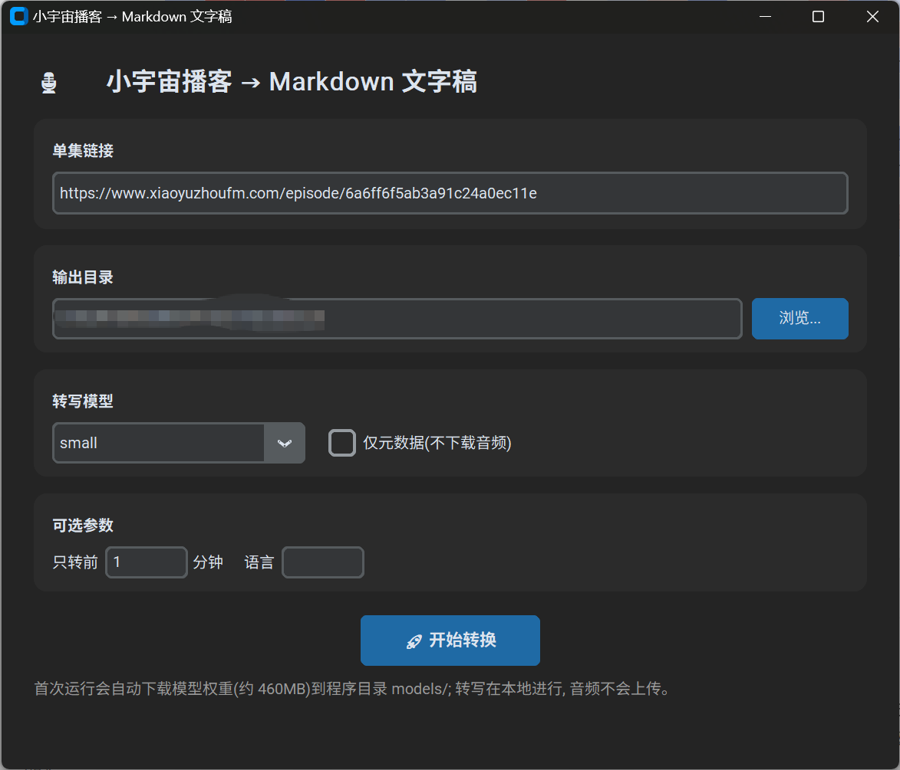
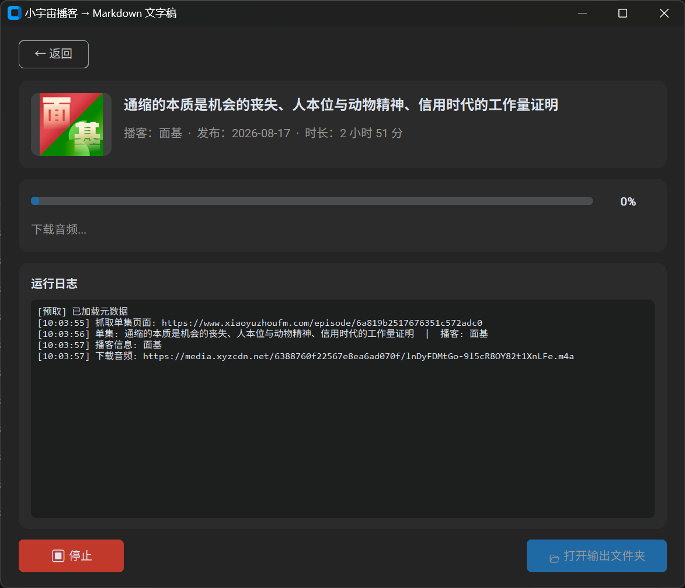
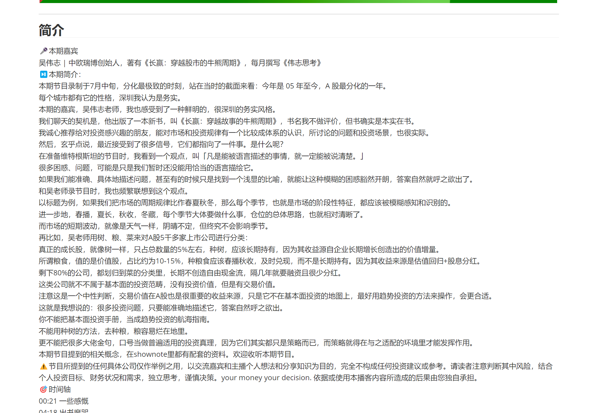
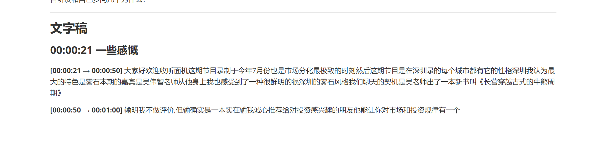

# 小宇宙播客 → Markdown 文字稿工具 (xyz2md)

把「小宇宙」播客单集链接一键转成带时间戳的 Markdown 文字稿文档。

📦 仓库：https://github.com/AmazingBoyCrazy/xyz-md

## 截图预览

### 配置页 — 填链接、选目录、点开始



### 转写页 — 封面 + 标题 + 进度条 + 日志



### 输出效果 — Markdown 文档

元数据 + 封面 + 时间轴分章节的文字稿：


简介区（嘉宾 / 时间轴 / 相关资料）：



章节标题按时间轴插入：



## 两种使用方式

### 1. 图形界面（推荐，桌面软件）

基于 **CustomTkinter**（Win11/macOS 风格深/浅色主题）。三页切换：

- **配置页**：粘贴链接 → 选输出目录 → 选模型 → 可选参数 → 「🚀 开始转换」
- **转写页**：实时显示播客封面、单集标题、播客名；进度条 + 百分比 + 已用时/剩余；滚动日志；「⏹ 停止」按钮
- **美化页**：转写完成后自动跳转 — 提示完成状态 / 展示耗时与段数 / 自动繁简转换提示 / **API 精修**（可选）：调用 LLM 给文字稿加标点、修正同音错别字，输出 `_精修.md`

```powershell
.\.venv\Scripts\python xyz2md_gui.py
```

### 2. 命令行

```powershell
.\.venv\Scripts\python xyz2md.py https://www.xiaoyuzhoufm.com/episode/<eid>
```

打包后的 exe 也支持命令行模式：`xyz2md.exe --cli <链接> [选项]`

## 原理

1. 抓取单集页面 (`https://www.xiaoyuzhoufm.com/episode/<eid>`)，解析
   `og:audio`、JSON-LD 等元数据（标题 / 播客名 / 完整简介 / 发布时间 / 时长 / 封面 / 音频地址）
2. 下载音频 (m4a)
3. 用 [faster-whisper](https://github.com/SYSTRAN/faster-whisper) 在本地 CPU 转写
   （模型权重首次运行自动从 HuggingFace 下载，转写全程离线，不上传任何音频）
4. 生成 Markdown：元数据 + 简介 + 节目配图 + 播客信息 + 按时间轴分章节的带时间戳文字稿

## 生成的 Markdown 结构

```
# 单集标题
- 播客 / 发布时间 / 时长 / 单集链接 / 播客链接 / 音频文件


## 简介            <- 完整 shownotes（含嘉宾、时间轴、相关资料）
### 节目配图       <- shownotes 内嵌图片（网络链接引用，主流 MD 阅读器可直接显示）
## 关于播客        <- 播客名 / 主播 / 播客简介（来自播客页）
## 文字稿
### 00:04:18 出书魔咒      <- 章节标题，来自简介时间轴，按时间插入
**[00:04:20 → 00:04:50]** 转写文本
```

## 环境要求

- Python 3.8+（Windows 建议 3.11）
- 无需 ffmpeg（faster-whisper 自带解码库）

## 安装

```powershell
python -m venv .venv
.\.venv\Scripts\python -m pip install -r requirements.txt
```

## 用法

```powershell
.\.venv\Scripts\python xyz2md.py https://www.xiaoyuzhoufm.com/episode/<eid>
```

输出到 `out/` 目录：
- `{eid}_{单集标题}.md` —— 最终文档
- `{eid}.json` —— 元数据
- `{eid}.m4a` —— 下载的音频

### 常用选项

| 选项 | 说明 |
| --- | --- |
| `--model tiny/base/small/medium/large-v3` | Whisper 模型，默认 `small`（中文建议至少 small；medium/large-v3 更准但慢很多） |
| `--out DIR` | 输出目录，默认 `./out` |
| `--no-audio` | 不下载音频，仅生成元数据文档 |
| `--limit-minutes N` | 只转写前 N 分钟（快速预览/测试） |
| `--lang zh` | 指定语言，默认自动检测 |
| `--condition` | 允许模型参考前文（长音频可能产生重复文本，默认关闭） |

### 示例

```powershell
# 完整转写
.\.venv\Scripts\python xyz2md.py https://www.xiaoyuzhoufm.com/episode/6a6ff6f5ab3a91c24a0ec11e

# 只转写前 10 分钟（快速验证）
.\.venv\Scripts\python xyz2md.py <链接> --limit-minutes 10

# 换用更高精度模型
.\.venv\Scripts\python xyz2md.py <链接> --model medium

# 只抓元数据不下载音频
.\.venv\Scripts\python xyz2md.py <链接> --no-audio
```

## 速度与内存参考（CPU）

- `tiny` / `base`：约 10× 实时，内存 < 1GB
- `small`：约 5–10× 实时，内存约 1GB（推荐；低内存机器首选）
- `medium`：约 2–4× 实时，内存约 2.5GB（中文精度更好，2 小时节目约需 1 小时）
- `large-v3`：约 1× 实时，内存 5GB+（不推荐低内存机器使用）

> 💡 工具内部自动使用 faster-whisper 的**分批转写引擎**（逐 30 秒块计算特征），
> 长音频也不会一次性占用数 GB 内存。3–4GB 内存的电脑建议用 `small` 模型，
> 一台 16 核 CPU 转写 2 小时节目约需 10–25 分钟。

模型权重首次使用会自动下载（small 约 460MB），缓存到脚本目录下的 `models/` 文件夹（可用环境变量 `HF_HOME` 覆盖）。国内网络慢时可设置镜像：

```powershell
$env:HF_ENDPOINT = "https://hf-mirror.com"
```

## 打包成 exe（桌面软件）

```powershell
.\.venv\Scripts\python -m pip install pyinstaller customtkinter
.\.venv\Scripts\pyinstaller --noconfirm --clean --onefile --windowed --name xyz2md `
  --workpath build --distpath dist --specpath build `
  --collect-all faster_whisper --collect-all ctranslate2 --collect-all onnxruntime `
  --collect-all av --collect-all huggingface_hub --collect-all tokenizers `
  --collect-all customtkinter --collect-all PIL --collect-data opencc xyz2md_gui.py
```

产物：`dist\xyz2md.exe`（单文件，约 90–400MB，包含全部运行库）。
首次运行会在 exe 同目录的 `models/` 下自动下载模型权重（small 约 460MB），
exe 可整体拷贝到别的 Windows 电脑直接使用（模型目录可一并拷贝，免去重复下载）。

如果单文件版在受限环境（如沙箱/无 %TEMP% 写权限）启动报解压错误，
可改用文件夹版：把上面命令的 `--onefile` 换成 `--onedir`，产物为
`dist\xyz2md_dir\` 目录，启动无需解压，整个文件夹拷走即可。

> 说明：exe 体积大是因为内置了离线语音识别引擎（ctranslate2/onnxruntime/PyAV）；
> 转写全程本地进行，不依赖任何账号或网络服务（除首次下载模型）。

## 注意

- 个别单集需要登录才能收听，此类页面抓不到音频地址，工具会明确报错
- 转写质量取决于模型大小和音频清晰度；多人对话、背景音乐会降低准确率
- 被中断时（Ctrl+C）会保留已转写的部分文字稿
